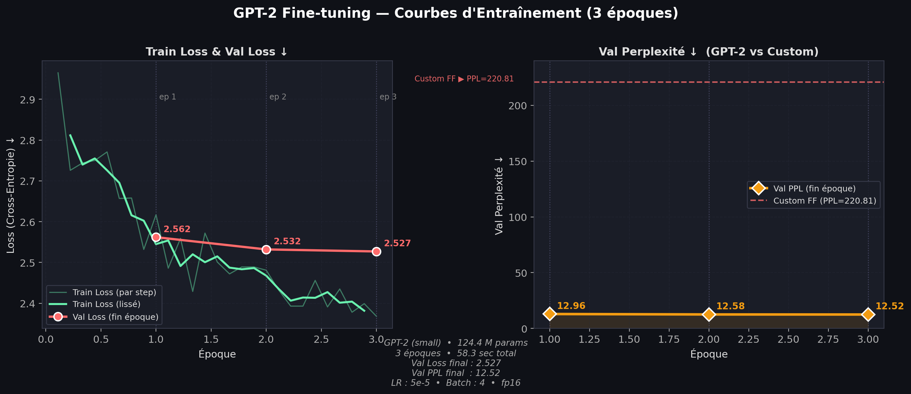

# 🎵 Génération de Paroles de Chanson par Apprentissage Automatique
### Deep Learning — Travail Pratique

**Abdellah Saaid & Chihab Eddine Ethamry**  
Mai 2026

---

## Slide 1 — Problématique

> **Comment générer des paroles de chansons cohérentes, différenciées par genre musical, à partir de données brutes ?**

### Deux approches comparées

| | Modèle Custom | GPT-2 Fine-tuné |
|---|---|---|
| Type | Feed-Forward NN (from scratch) | Transformer (pré-entraîné) |
| Implémentation | NumPy / CuPy | HuggingFace Transformers |
| Paramètres | ~4.2 M | 124.4 M |
| Objectif | Pédagogique | Référence état de l'art |

---

## Slide 2 — Dataset Spotify

- **Source :** Kaggle — Spotify Songs + Lyrics (~18 000 entrées)
- **Après nettoyage :** 14 517 chansons en anglais avec paroles valides
- **Split :** 11 613 train / 2 904 val (séparation **au niveau chanson**)

### 5 Genres retenus

| Genre | Chansons | Caractéristique |
|---|:---:|---|
| Pop | 3 737 | Structures couplet/refrain, thèmes d'amour |
| Rock | 3 388 | Intensité, rébellion, narration |
| R&B | 3 160 | Richesse émotionnelle, rythme soul |
| Rap | 2 500 | Flux rapide, rimes complexes |
| EDM | 1 732 | Répétitif, énergie haute |


---

## Slide 3 — Prétraitement & Vocabulaire

### Pipeline de prétraitement

```
Texte brut
  → lowercase
  → suppression caractères spéciaux
  → tokenisation (split espace)
  → encodage en indices
  → fenêtre glissante (SEQ_LEN = 20)
```

### Vocabulaire
- Fréquence minimale : `MIN_FREQ = 3`
- Taille maximale : `MAX_VOCAB_SIZE = 12 000`
- Tokens spéciaux : `<PAD>`, `<UNK>`, `<BOS>`, `<EOS>`
- **Vocabulaire final : 12 004 tokens**

### Création des paires (next-word prediction)

```
Chanson : [<BOS>, "i", "love", "you", <EOS>]

  X = [<BOS>]              → y = "i"
  X = [<BOS>, "i"]         → y = "love"
  X = [<BOS>, "i", "love"] → y = "you"
```

**Total : 5 547 617 paires**  
(4 449 959 train / 1 097 658 val)


---

## Slide 4 — Architecture Custom (Feed-Forward)

```
Entrée X [batch, SEQ_LEN=20]
        │
        ▼
┌──────────────────────────────┐
│  Word Embedding              │   12 004 × 64  →  [batch, 20, 64]
└──────────┬───────────────────┘
           │ flatten → [batch, 1 280]
           │
┌──────────▼──────────────┐
│  Genre Embedding         │   5 × 64  →  [batch, 64]
└──────────┬───────────────┘
           │
           ▼ concat → [batch, 1 344]
┌──────────────────────────┐
│  Dense W1  + ReLU        │   1 344 → 256
│  + Dropout (p = 0.15)    │
└──────────┬───────────────┘
           ▼
┌──────────────────────────┐
│  Dense W2  + Softmax     │   256 → 12 004
└──────────────────────────┘
           ▼
   P(mot suivant | contexte, genre)
```

### Paramètres

| Composant | Dimensions | Paramètres |
|---|---|---|
| `word_embedding` | 12 004 × 64 | 768 256 |
| `genre_embedding` | 5 × 64 | 320 |
| `W1` | 1 344 × 256 | 344 064 |
| `b1` | 256 | 256 |
| `W2` | 256 × 12 004 | 3 073 024 |
| `b2` | 12 004 | 12 004 |
| **Total** | | **~4,2 M** |

### Initialisation des poids

```python
# He initialization — couches ReLU
W1 = np.random.randn(input_dim, hidden_dim) * np.sqrt(2 / input_dim)

# Xavier initialization — couche de sortie linéaire
W2 = np.random.randn(hidden_dim, vocab_size) * np.sqrt(1 / hidden_dim)

# Embeddings — variance modérée
word_embedding = np.random.randn(vocab_size, embed_dim) * 0.1
```

---

## Slide 5 — Fonction de Coût

### Pourquoi la Cross-Entropie ?

Problème de **classification multi-classes** : choisir 1 mot parmi 12 004.

$$\mathcal{L}_{CE} = -\log(\hat{p}_{\text{cible}}) = -\sum_{c=1}^{V} y_c \cdot \log(\hat{p}_c)$$

**Lien avec la Perplexité (métrique principale) :**

$$\text{PPL} = e^{\mathcal{L}_{CE}}$$

Minimiser la loss ≡ minimiser la perplexité.

---

### Label Smoothing ($\varepsilon = 0.05$)

Sans smoothing, le modèle devient sur-confiant (sature le softmax). Avec :

$$\tilde{y}_c = \begin{cases} 1 - \varepsilon = 0.95 & \text{si } c = \text{cible} \\ \dfrac{\varepsilon}{V - 1} \approx 4 \times 10^{-6} & \text{sinon} \end{cases}$$

$$\mathcal{L}_{LS} = -\sum_{c=1}^{V} \tilde{y}_c \cdot \log(\hat{p}_c)$$

> 5 % de la masse est redistribuée → le modèle reste ouvert à plusieurs mots plausibles.

---

## Slide 6 — Hyperparamètres

| Paramètre | Valeur | Justification |
|---|:---:|---|
| `NUM_EPOCHS` | 15 | Early stopping déclenché à 15 ; val_loss stable |
| `BATCH_SIZE` | 128 | Compromis stabilité du gradient / vitesse |
| `LEARNING_RATE` | 0.01 | LR élevé au départ, atténué par decay |
| `LR_DECAY` | 0.95 | $\text{lr}_e = 0.01 \times 0.95^{e}$ |
| `DROPOUT_RATE` | 0.15 | Régularisation légère — évite sur-apprentissage |
| `LABEL_SMOOTHING` | 0.05 | Évite sur-confiance, améliore généralisation |
| `EMBEDDING_DIM` | 64 | Représentation compacte mais expressive |
| `HIDDEN_DIM` | 256 | 4× embedding dim — ratio classique |
| `SEQ_LEN` | 20 | Contexte suffisant, génère plus de paires |
| `MIN_FREQ` | 3 | Élimine hapax et fautes de frappe |
| `MAX_VOCAB_SIZE` | 12 000 | Riche sans exploser la couche W2 |

### Décroissance du Learning Rate

$$\text{lr}_{e} = \max\!\left(\text{lr}_0 \times 0.95^{e},\ \text{lr}_{\min}\right)$$

### Gradient Clipping

$$\text{grad} \leftarrow \text{grad} \cdot \min\!\left(1,\ \frac{5.0}{\|\text{grad}\|}\right)$$

---

## Slide 7 — Backpropagation (from scratch)

### Forward Pass

```python
# 1. Word Embedding  [batch, seq_len, embed_dim]
word_vecs = word_embedding[X]           # lookup

# 2. Genre Embedding  [batch, embed_dim]
genre_vec = genre_embedding[genre_ids]

# 3. Concat  [batch, seq_len*embed + embed]
combined = concat(word_vecs.flatten(), genre_vec)

# 4. Hidden layer
z1 = combined @ W1 + b1
a1 = relu(z1)
a1 = dropout(a1, p=0.15)

# 5. Output
logits = a1 @ W2 + b2
probs  = softmax(logits)
```

### Backward Pass

$$\frac{\partial \mathcal{L}}{\partial W_2} = a_1^\top \cdot \delta_{\text{logits}}$$

$$\frac{\partial \mathcal{L}}{\partial W_1} = \text{combined}^\top \cdot \left(\delta_{a_1} \odot \mathbf{1}[z_1 > 0]\right)$$

$$\frac{\partial \mathcal{L}}{\partial E_{\text{word}}} = \texttt{scatter\_add}\!\left(\delta_{\text{word}},\ \text{token\_ids}\right)$$

> L'embedding reçoit ses gradients via `np.add.at()` — un `scatter_add` qui accumule les gradients par token.

---

## Slide 8 — Résultats du Modèle Custom

### Évolution sur 15 époques

| Époque | Train Loss | Val Loss | Val PPL |
|:---:|:---:|:---:|:---:|
| 1 | 6.853 | 6.225 | 505 |
| 3 | 6.202 | 5.875 | 356 |
| 5 | 6.006 | 5.706 | 301 |
| 10 | 5.772 | 5.499 | 244 |
| **15** | **5.654** | **5.397** | **221** |

**Amélioration :** PPL initiale ~12 004 (uniforme) → **220.81** (×54)


---

### Qualité de génération par genre

| Genre | Ratio Unique | Rép. Bigrams | Rép. Trigrams |
|---|:---:|:---:|:---:|
| EDM | 0.60 | 0.15 | 0.08 |
| Pop | 0.60 | 0.05 | 0.00 |
| R&B | 0.33 | 0.41 | 0.18 |
| Rap | 0.47 | 0.28 | 0.16 |
| Rock | 0.53 | 0.08 | 0.00 |


---

## Slide 9 — Architecture GPT-2

GPT-2 (OpenAI, 2019) — architecture **Transformer** avec **attention multi-têtes masquée**.

```
┌─────────────────────────────────┐
│  Token Embedding (50 257 vocab) │  dim = 768
│  + Position Embedding           │
└────────────────┬────────────────┘
                 │
        ┌────────┴────────┐
        │   × 12 couches  │
        │  ┌────────────┐ │
        │  │ Self-Attn  │ │  12 têtes, dim_head = 64
        │  │ (Masked)   │ │
        │  ├────────────┤ │
        │  │ Layer Norm │ │
        │  ├────────────┤ │
        │  │ Feed-Fwd   │ │  768 → 3 072 → 768  (GELU)
        │  └────────────┘ │
        └────────┬────────┘
                 │
        ┌────────▼────────┐
        │  LM Head        │  768 → 50 257
        └─────────────────┘
```

### Self-Attention (mécanisme clé)

$$\text{Attention}(Q, K, V) = \text{softmax}\!\left(\frac{QK^\top}{\sqrt{d_k}}\right) V$$

Avec $d_k = 64$ (dimension par tête). GPT-2 peut relier **n'importe quels tokens** dans une fenêtre de **1 024** — contre 20 pour notre modèle.

### Fine-tuning (3 lignes effectives)

```python
from transformers import GPT2LMHeadModel, Trainer, TrainingArguments

model = GPT2LMHeadModel.from_pretrained('gpt2')   # 124.4 M params pré-entraînés

training_args = TrainingArguments(
    num_train_epochs=3,
    learning_rate=5e-5,           # warmup 50 steps → décroissance linéaire
    per_device_train_batch_size=4,
    fp16=True,                    # mixed precision — 2× plus rapide
    weight_decay=0.01,
    warmup_steps=50,
)

trainer = Trainer(model=model, args=training_args,
                  train_dataset=ds['train'], eval_dataset=ds['test'])
trainer.train()   # ← 58.3 secondes sur GPU
```

---

## Slide 10 — Résultats GPT-2

| Métrique | Valeur |
|---|---|
| Val Loss final | **2.527** |
| Val PPL final | **12.52** |
| Temps fine-tuning | **58.3 secondes** |
| Époques | 3 |
| Paramètres | 124.4 M |



> La loss val descend régulièrement (2.562 → 2.532 → 2.527), la PPL converge à **12.52**, le LR suit le schedule linéaire HuggingFace, la norme des gradients se stabilise après l'époque 1.

---

## Slide 11 — Comparaison des Deux Approches

| Critère | Feed-Forward Custom | GPT-2 Fine-tuné |
|---|:---:|:---:|
| **Val PPL** | 220.81 | **12.52** |
| **Val Loss** | 5.397 | **2.527** |
| **Paramètres** | 4.2 M | 124.4 M |
| **Temps entraînement** | 39.2 min | **58 sec** |
| **Contexte** | 20 tokens | 1 024 tokens |
| **Pré-entraînement** | ✗ | ✓ (40 GB WebText) |
| **Attention** | ✗ | ✓ (12 têtes) |
| **Code transparent** | ✓ | ✗ |
| **Contrôle du genre** | ✓ (embedding dédié) | Partiel (prompt) |

$$\text{Ratio PPL} = \frac{220.81}{12.52} = \times 17.6 \text{ plus précis}$$


---

## Slide 12 — Exemples de Paroles Générées

### Modèle Custom — Genre ROCK

> *it like a and do the you down all get take is never me no got i'm of it's your life ain't be so more to love but if i know you, for this baby what with my time oh i think too say that when we are away don't tell me...*

✅ Mots anglais reconnaissables | ⚠️ Pas de cohérence grammaticale | ⚠️ Pas de narration

---

### GPT-2 Fine-tuné — Genre POP

> *no, i don't like it popout the lights down 'cause you gotta have a drink now so that we can get out there sing along all night (don't know what to say) oh baby when will ya take my breath away?*

> *hey, let's go grab some water and run 'round to the beach or just ride on our old horses now i see you've got a bottle of wine in your hand tell me if this time is different we'll do it right with love again don't be shy...*

✅ Syntaxe naturelle | ✅ Contractions (`'cause`, `ain't`) | ✅ Cohérence narrative | ✅ Images poétiques

---

### Stratégie de décodage (les deux modèles)

```python
# Pipeline logit-space
logits[PAD] = logits[BOS] = logits[UNK] = -inf   # bloquer tokens spéciaux
logits[tok] -= log(repeat_penalty)                 # pénalité répétition récente
logits[tok] -= presence_penalty                    # pénalité présence globale
logits[tok] -= frequency_penalty × count           # pénalité fréquence

# Échantillonnage
logits = top_k(logits, k=60)
logits = top_p(logits, p=0.92)    # nucleus sampling
token  = sample(softmax(logits))
```

---

## Slide 13 — Conclusion

### Ce que nous avons accompli

| Réalisation | Résultat |
|---|---|
| Réseau FF from scratch (NumPy) | Val PPL = **220.81** (×54 vs uniforme) |
| Backpropagation manuelle complète | Embeddings + Dense + Softmax |
| Fine-tuning GPT-2 | Val PPL = **12.52** en 58 secondes |
| Comparaison quantitative | ×17.6 en faveur de GPT-2 |
| Pipeline ML robuste | Song-level split, early stopping, checkpoints |

### Ce que cette comparaison illustre

```
Feed-Forward (1986)          Transformer (2017)
   4.2 M params         →      124.4 M params
   fenêtre 20 tokens    →      1 024 tokens
   PPL = 220.81         →      PPL = 12.52
   39.2 minutes         →      58 secondes
```

> *"Attention is All You Need"* — Vaswani et al., 2017

### Perspectives

| Amélioration | Gain estimé |
|---|---|
| Remplacer FF par LSTM/GRU | PPL ~150–180 |
| Augmenter `HIDDEN_DIM` à 512 | PPL ~200 |
| GPT-2 medium (345 M params) | PPL ~8–10 |
| Dataset complet (18k chansons) | PPL ~180 |

---

## Structure du Projet

```
TP_Paroles_Code_Complet/
├── TP_Paroles_Code_Complet.py   ← Modèle custom (entraînement from scratch)
├── gpt2_finetune.py             ← Fine-tuning GPT-2 (HuggingFace)
├── make_graphs.py               ← Génération des 7 graphiques
├── graphs+logs/
│   ├── training_curves.png      ← Courbes custom (Loss, PPL, Acc, Gap)
│   ├── gpt2_training_curve.png  ← Courbes GPT-2 (Loss, PPL, LR, GradNorm)
│   ├── model_comparison.png     ← Tableau comparatif visuel
│   ├── dataset_distribution.png ← Répartition des genres
│   ├── vocab_frequency.png      ← Distribution Zipf du vocabulaire
│   ├── generation_quality.png   ← Métriques par genre
│   └── overfitting_gap.png      ← Écart val−train
└── outputs/
    └── lyrics_model_best.pkl    ← Meilleur modèle custom sauvegardé
```

---

*Deep Learning / NLP — Mai 2026*  
**Abdellah Saaid & Chihab Eddine Ethamry**
